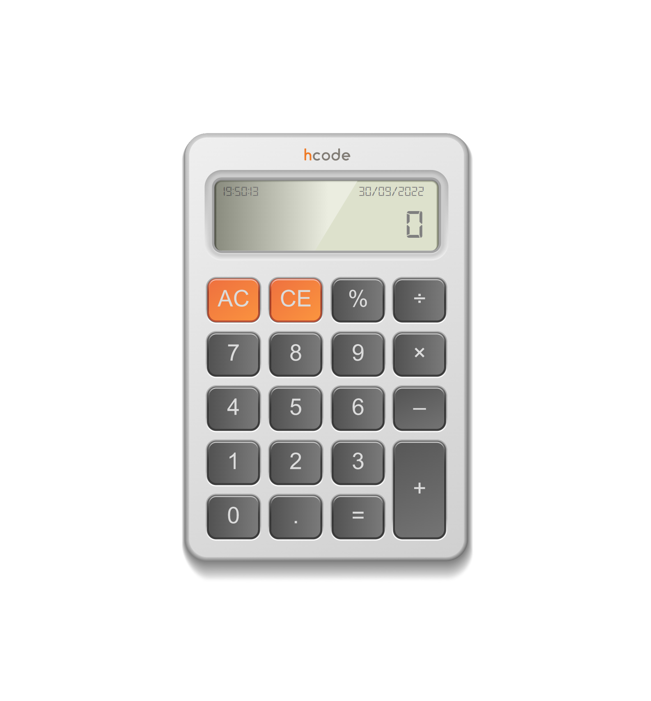

# Projeto Calculadora HCode

 

Desenvolvido durante as aulas de Javascript na plataforma da HCode. 09/22 

[🔗 Clique aqui para acessar] (https://michel-maia.github.io/Projeto-Calculadora-HCode/)

## 💻 Tecnologias

As seguintes ferramentas foram usadas na construção do projeto:

- HTML
- CSS
- JavaScript

## Referências 
HCode

- [Youtube] https://www.youtube.com/c/HcodeBrasil
- [HCode] https://www.hcode.com.br/

